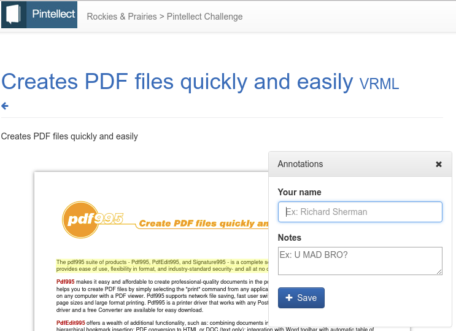

# PDF/HTML highlither and annotator 
## React and Redux

This application allows for the user to make highlights and annotations
on PDF files and HTML pages.

Built for the VanHack Week Nov/2017:
http://www.vanhack.com/week/

Based on [Create React App](https://github.com/facebookincubator/create-react-app).

Basic technologies:

**Npm**, Node.js® is a JavaScript runtime built on Chrome's V8 JavaScript engine.
 
**React**, is a Javascript library for building user interfaces.

**Redux**, Redux is a predictable state container for JavaScript apps.

## Installation

Install Npm:

    https://nodejs.org
    
After forking and cloning the repo:

    cd pdf-annotator
    npm install
    npm run start-mockapi
    npm start

Obs.: `npm start-mockapi` will start the mock API server.

## Team

- Otávio Soares - https://github.com/otaviosoares
- Rafael Leite - https://github.com/leite08
- ...

## Tech Stack

- Npm
- React
- Redux
- [Request-Promise-Native](https://github.com/request/request-promise-native)

## License

Licensed under the [MIT](http://www.opensource.org/licenses/mit-license.php)  license.
